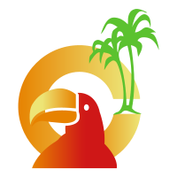
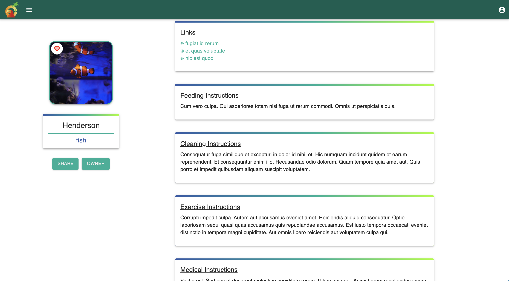
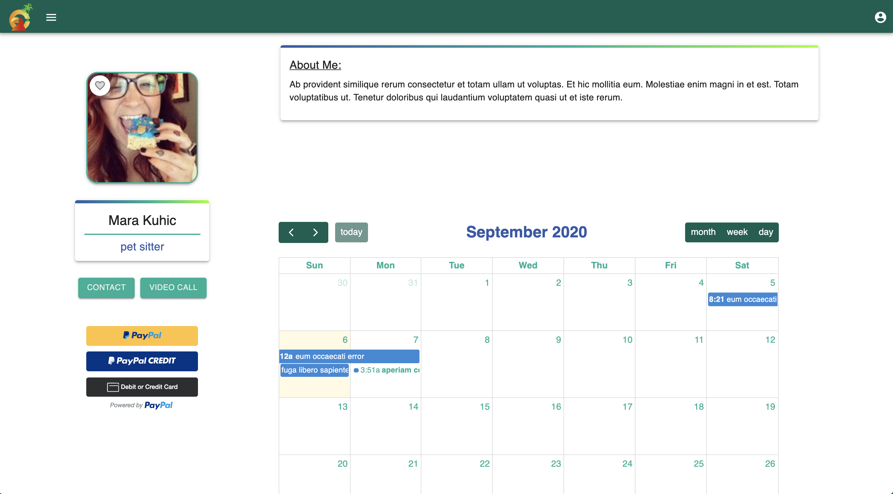
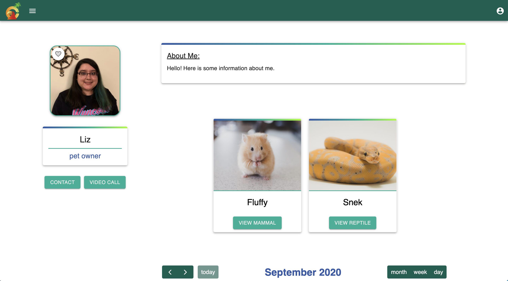
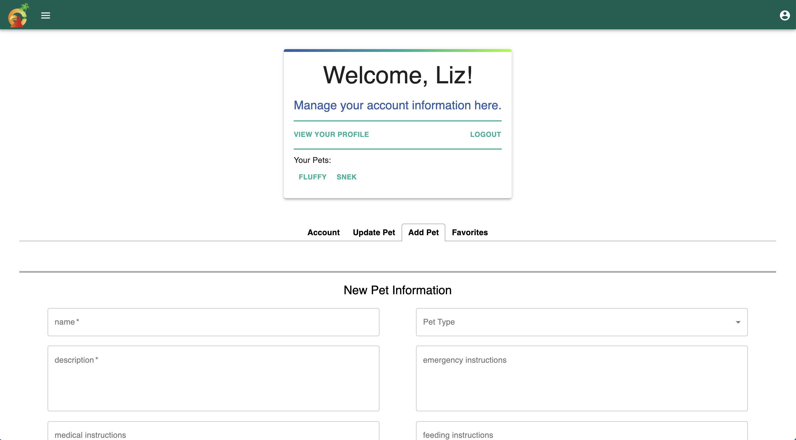
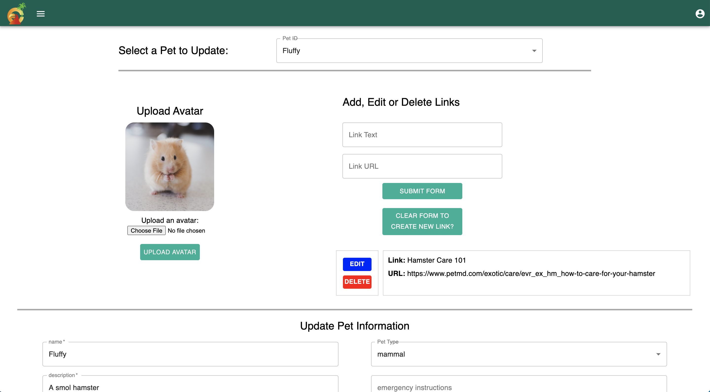
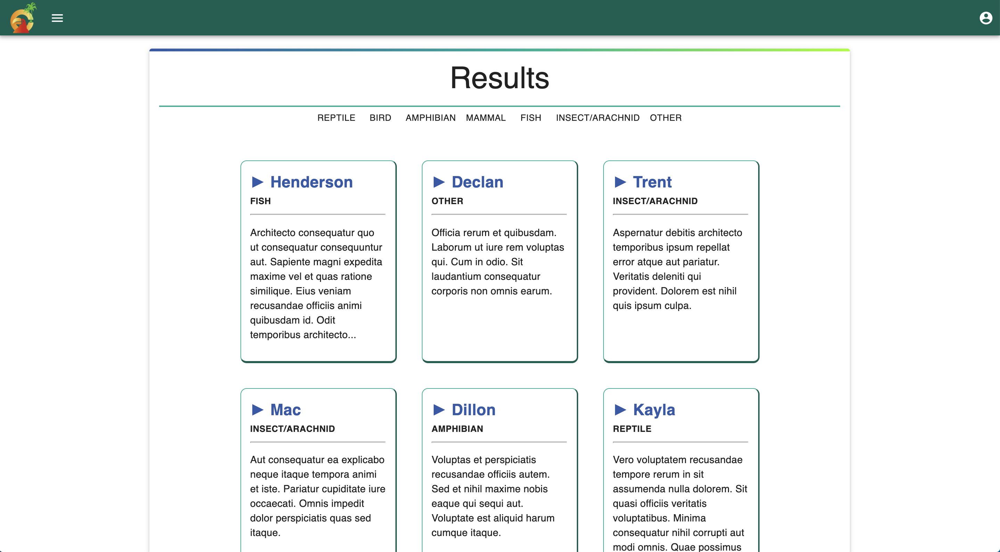
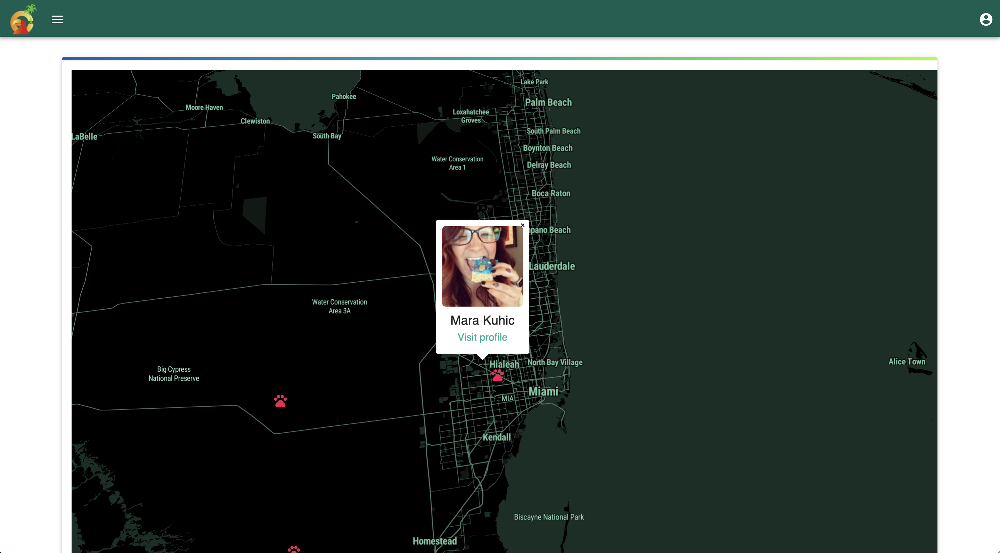

#  Petster Exotic

## Intro

Petster Exotic is a user-friendly web app for exotic pet owners and sitters for exotic pets to connect online. Users can store information, search for other users, and can contact each other via email and video calls.

Specific features include:

- Pet sitters can be paid through a PayPal interface on the site.
- Pet owners can store care instructions and pet data so that their pet sitters can easily reference pet information for difficult-to-care-for pets.
- Users can update a calendar to show their availability or provide information about appointments or important dates.
- Users can search for each other via text search or with a map that displays other users near their location.
- Users can save their favorite pet or user profile for easy future reference.

## Overview

-We used the MERN stack for our app: MongoDB to store data, Express for our server, React for our front end and Node.js as our runtime.

- Used the MongoDB database to store our information. We have two models/collections: pets and users. Users who are pet owners can have many pets but pets can only have one owner.

-We integrated several APIs and frameworks into our site:

- Mapbox for the geolocation map interface.
- Jitsi for the video call functionality.
- Fullcalendar.io as our calendar framework.
- Sendgrid for our email functionality.
- Materials-UI for the front end components and design.
- Cloudinary to upload and manage user images.
- To keep track of login information, we used JWT-based token authentication, bcrypt for password hashing, and Passport for user authentication.

## Screenshots

## Installation and Run on Local Machine

Application uses ports localhost 3000 and 8080.

    #clone it
    git clone https://github.com/wyncode/C38_snakes_on_a_repo.git

    #run yarn to install dependencies
    yarn install
    yarn && cd client && yarn

    #start both front and back end severs on one command
    cd .. && yarn dev

## Back End Usage

Click the button to download the API endpoints for our application!

We have a seed file available in server/db/seeds for you to start up with faker-provided data.

## Dependencies

| Client Side               | Server Side             |
| ------------------------- | ----------------------- |
| @fullcalendar/daygrid     | @sendgrid/mail          |
| @fullcalendar/interaction | bcryptjs                |
| @fullcalendar/react       | cloudinary              |
| @fullcalendar/timegrid    | concurrently            |
| @material-ui/core         | cookie-parser           |
| @material-ui/icons        | express                 |
| react-scroll-to           | express-file-upload     |
| axios                     | faker                   |
| styled-components         | jsonwebtoken            |
| sweetalert                | mongodb                 |
| react-paypal-button-v2    | mongoose                |
| react                     | mongoose-findorcreate   |
| react-dom                 | passport                |
| react-map-jl              | passport-local-mongoose |
| react-router-dom          | passport-jwt            |
| react-scripts             | passport-local          |
| react-tabs                | validator               |
| react-spinners            | moment                  |
| moment                    |                         |

## About Us

We are a group of three Wyncode students who wanted to use this opportunity to offer exotic pet owners and sitters a convenient way to find, communicate and share information with each other online.

**Liz W.** Full Stack Web Development student from Wyncode's Cohort 38. Currently enjoying the journey of transitioning my career from retail management to web developer! Find my GitHub profile [here](https://github.com/e-a-w)!

**Erialbania L.** Full Stack Web Development student from Wyncode's Cohort 38. Former digital marketing coordinator looking to make a career change into the tech industry. Find my GitHub profile [here](https://github.com/Erialbania)!

**Juan P.** Full Stack Web Development student from Wyncode's Cohort 38 -- with a background in hospitality and IT Support, I'm always interested in learning more about technology. Find my GitHub profile [here](https://github.com/juanjpayan)!

## Deployment

This project is deployed via heroku at [petster-exotic.herokuapp.com](www.petster-exotic.herokuapp.com)
